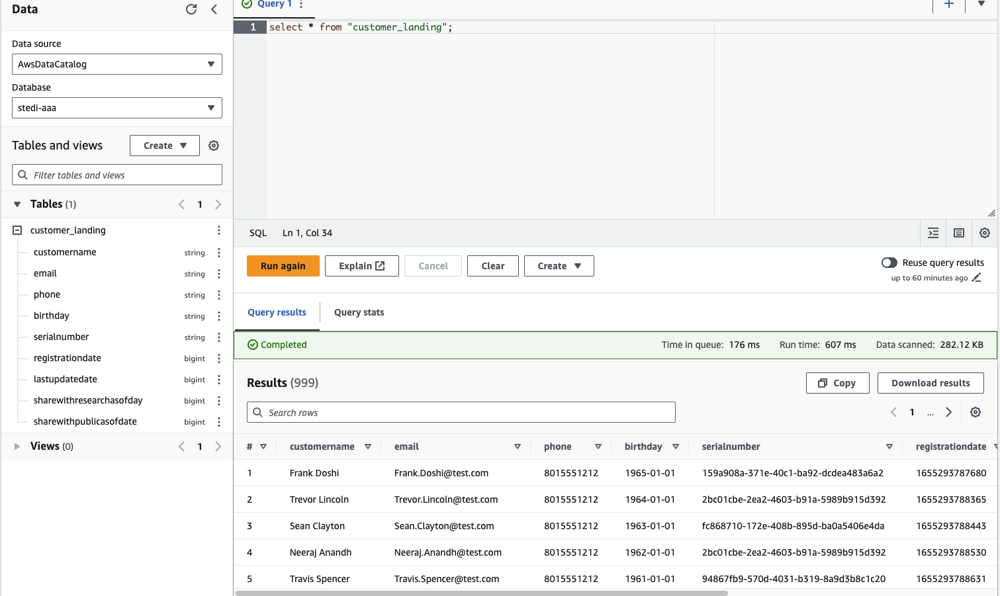
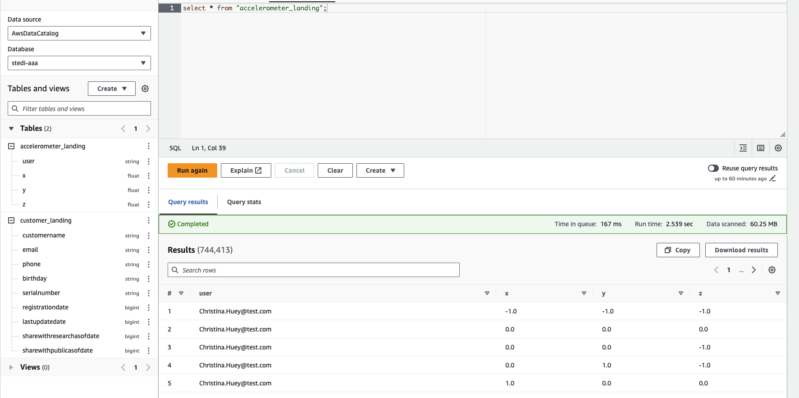
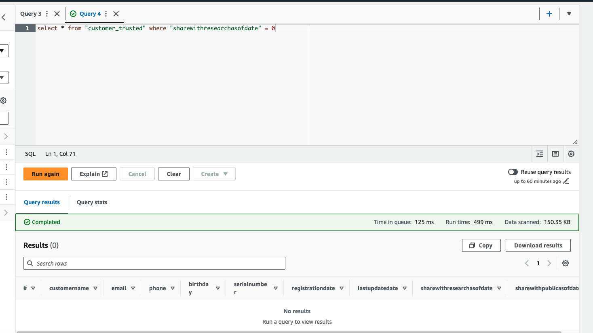
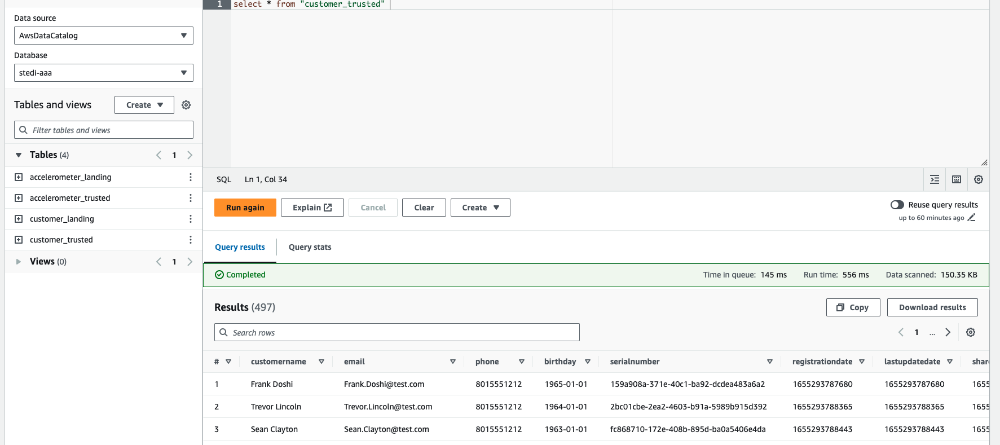

# Project 3 - STEDI Human Balance Analytics

## Project Intro
Spark and AWS Glue allow you to process data from multiple sources, categorize the data, and curate it to be queried in the future for multiple purposes.
We'll act as a data engineer for the STEDI team to build a data lakehouse solution for sensor data that trains a machine learning model.
As a data engineer on the STEDI Step Trainer team, we'll need to extract the data produced by the STEDI Step Trainer sensors and the mobile app, and curate them into a data lakehouse solution on AWS so that Data Scientists can train the learning model.

## Project Details
The STEDI Team has been hard at work developing a hardware STEDI Step Trainer that:

trains the user to do a STEDI balance exercise;
and has sensors on the device that collect data to train a machine-learning algorithm to detect steps;
has a companion mobile app that collects customer data and interacts with the device sensors.
STEDI has heard from millions of early adopters who are willing to purchase the STEDI Step Trainers and use them.

Several customers have already received their Step Trainers, installed the mobile application, and begun using them together to test their balance. The Step Trainer is just a motion sensor that records the distance of the object detected. The app uses a mobile phone accelerometer to detect motion in the X, Y, and Z directions.

The STEDI team wants to use the motion sensor data to train a machine learning model to detect steps accurately in real-time. Privacy will be a primary consideration in deciding what data can be used.

Some of the early adopters have agreed to share their data for research purposes. Only these customers’ Step Trainer and accelerometer data should be used in the training data for the machine learning model.

## Project Summary

### Landing Zone
The Glue tables were created using the following SQL scripts:

[customer_landing.sql](./scripts/customer_landing.sql)

[accelerometer_landing.sql](./scripts/accelerometer_landing.sql)

Here's what they look like in Athena.

### Trusted Zone
The Glue jobs that were written to move landing data to trusted data are:

[customer_landing_to_trusted.py](./scripts/customer_landing_to_trusted.py): Protecting sensitive information through filtering

[accelerometer_landing_to_trusted.py](./scripts/accelerometer_landing_to_trusted.py): Protecting sensitive information through a join with the customer trusted data

[step_trainer_landing_to_trusted.py](./scripts/step_trainer_landing_to_trusted.py): Filtering data for users with accelerometer data and who have agreed to share data

One can verify that sensitive information is filtered out through looking at the Athena output:
Here's what they look like in Athena:

### Currated Zone
The Glue jobs that get the data from trusted to curated are:

[customer_trusted_to_curated.py](./scripts/customer_trusted_to_curated.py): Getting data for those customers that have opted in AND also that have accelerometer data
[machine_learning_curated.py](./machine_learning_curated.py): Aggregating a table that has each of the step trainer data points joined to the corresponding accelerometer data, only for customers who have opted into sharing data

